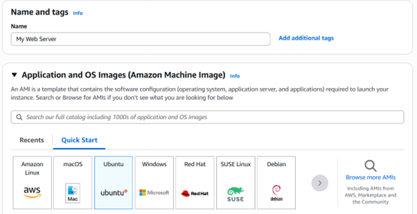
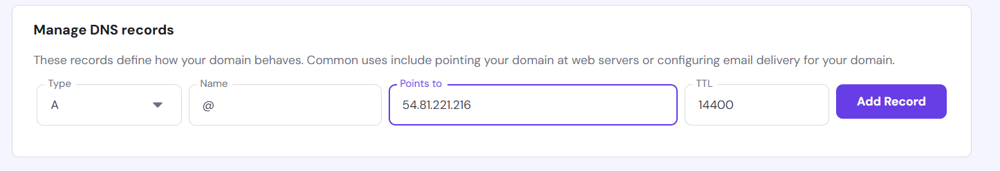

#  TechBlog Deployment Guide

**Author:** Zohaib Younas  
**Student ID:** 34858732  
**GitHub Repository:** [TechBlog](https://github.com/Zohaibkhan1472/TechBlog)

**Video Explainer Link:** [Video](https://drive.google.com/file/d/1_xAIYdmEol7iIX2hh6xX5i9blyEsRoTv/view?usp=drive_link)

**IP Address:** 54.81.221.216
##  Live Deployment

Access the live site using any of the following links:

- https://zohaibyounas.com/
- https://www.zohaibyounas.com/

##  Overview

This guide provides a complete step-by-step tutorial for deploying a static website (TechBlog) on an Amazon EC2 instance using Ubuntu, Nginx, Git, and Certbot for HTTPS support.  
You will launch a virtual server, install necessary software, deploy your website from GitHub, and configure domain and SSL settings.

---

## ☁ Step 1: Launch EC2 Instance

1. **Open AWS Console**  
   Log in to the [AWS Management Console](https://aws.amazon.com/console/) and search for `EC2`.
   


2. **Navigate to EC2 Dashboard**  
   Click on **EC2 – Virtual Servers in the Cloud** from the search results.

3. **Launch New Instance**  
   On the EC2 dashboard, click the orange **Launch instance** button on the right side.
    

4. **Configure Instance Name and OS**  
   - **Name:** Enter a name like `My Web Server` in the **Name** field.
   - **OS:** Select **Ubuntu** from the Quick Start list (blue tile with the Ubuntu logo).
    

5. **Create Key Pair**  
   - Click **Create new key pair**.
   - Name it e.g., `tech-blog-key`.
   - Leave default settings: `RSA`, `.pem`.
   - Click **Create key pair** – the `.pem` file will download.
   - **Save this file securely** – it's needed for SSH access.
   

6. **Configure Firewall (Security Group)**  
   Ensure these rules are enabled:
   -  Allow **SSH** (default)
   -  Allow **HTTP** from the internet
   -  Allow **HTTPS** from the internet
    

7. **Storage Settings**  
   - Default is **8 GiB gp3** – this is sufficient for a static website.
   - No changes needed.


8. **Review and Launch**  
   - Review all settings.
   - Click the orange **Launch instance** button.
   


9. **Confirmation**  
   - You’ll see a success message with your Instance ID (`i-xxxxxxxxxxxxxx`).
   - Click on **Instances** in the navigation bar to see your server.
   


---

##  Step 2: Connect to Your EC2 Instance

Once your EC2 instance is in the "running" state and both health checks pass, you can connect using either the AWS console or your terminal.

###  Method 1: EC2 Instance Connect (Browser)

1. Go to the **EC2 Dashboard**.
2. Select your instance and click **Connect**.
3. Use the **EC2 Instance Connect** tab:
   - Username: `ubuntu`
   - Public IPv4: `54.81.221.216`
4. Click the orange **Connect** button.
   

>  You’ll be connected to your server via browser-based SSH.

---

###  Method 2: Using Windows Command Prompt (with .pem file)

```bash
cd Downloads
ssh -i "tech-blog-key.pem" ubuntu@54.81.221.216
```


##  Step 3: Set Up Your Server

Follow the steps below to install required software, deploy your website, and configure your server.

---

###  1. Update the System

```bash
sudo apt update && sudo apt upgrade -y
```


---

###  2. Install Web Server Software

```bash
sudo apt install nginx git certbot python3-certbot-nginx -y
```

---

###  3. Start and Enable Nginx

```bash
sudo systemctl start nginx
sudo systemctl enable nginx
```

---

###  4. Download Website Files

```bash
cd /var/www/
sudo git clone https://github.com/Zohaibkhan1472/TechBlog.git
```

---

###  5. Set Proper File Permissions

```bash
sudo chown -R www-data:www-data /var/www/TechBlog
sudo chmod -R 755 /var/www/TechBlog
```


##  Step 4: Configure Nginx

In this step, you'll create a configuration file to tell Nginx how to serve your website.

---

###  1. Create a New Configuration File

```bash
sudo nano /etc/nginx/sites-available/techblog
```

---

###  2. Paste the Following Configuration

```nginx
server {
    listen 80;
    server_name 54.81.221.216 zohaibyounas.com www.zohaibyounas.com;

    root /var/www/TechBlog;
    index index.html;

    location / {
        try_files $uri $uri/ /index.html;
    }

    location ~* \.(css|js|jpg|jpeg|png|gif|ico|svg)$ {
        expires 30d;
        add_header Cache-Control "public, no-transform";
    }

    add_header X-Frame-Options "SAMEORIGIN" always;
    add_header X-Content-Type-Options "nosniff" always;
}
```

---

###  3. Enable the Configuration

```bash
sudo ln -s /etc/nginx/sites-available/techblog /etc/nginx/sites-enabled/
sudo rm /etc/nginx/sites-enabled/default
```

---

###  4. Test Nginx Configuration

```bash
sudo nginx -t
```


---

###  5. Restart Nginx

```bash
sudo systemctl restart nginx
```

##  Current Ports Configuration

Your TechBlog is running on these ports:

| Port | Service | Purpose |
|------|---------|---------|
| 22   | SSH     | Server access |
| 80   | HTTP    | Web traffic (redirects to HTTPS) |
| 443  | HTTPS   | Your secure website |

These ports were configured when you:
- **Port 22**: Automatically enabled by AWS
- **Port 80 & 443**: You selected "Allow HTTP" and "Allow HTTPS" during EC2 setup

**Your static website doesn't need any additional ports.**


##  Step 5: Configure DNS for Your Domain (Hostinger)

If you've registered your domain with [Hostinger](https://hostinger.com), follow these steps to point it to your EC2 instance:

---

###  1. Login to Hostinger Dashboard

1. Visit [https://www.hostinger.com](https://www.hostinger.com) and log in.
2. Go to **Domains** from the left sidebar.
3. Select your domain (e.g., `zohaibyounas.com`).
4. Click on **DNS / Nameservers**.


---

###  2. Add A Records

Add the following two **A records**:


| Type | Name  | Points to (IPv4)   | TTL    |
|------|-------|--------------------|--------|
| A    | @     | 54.81.221.216      | 1400   |
| A    | www   | 54.81.221.216      | 1400   |


>  `@` maps to your root domain  
>  `www` allows visitors to reach `www.zohaibyounas.com`




---

###  3. Delete Conflicting A Records

Remove any other A records that point to old or different IP addresses to avoid conflicts.

---

###  4. Wait for DNS Propagation

Changes can take **15–60 minutes** to fully propagate across the internet.

You can monitor DNS status here:

- [https://dnschecker.org](https://dnschecker.org)
- [https://whatsmydns.net](https://whatsmydns.net)

---

Once DNS is propagated and your domain shows your server’s Nginx welcome page or website files, continue to the next step: **installing SSL**.

##  Step 6: Secure Your Site with SSL (Certbot)

Now that your domain points to your EC2 server, you can use Certbot to install a free SSL certificate and enable HTTPS.

---

###  1. Run Certbot for Nginx

```bash
sudo certbot --nginx -d zohaibyounas.com -d www.zohaibyounas.com
```

---

###  2. Follow Certbot Prompts

You will be asked the following:

-  **Email Address** – for renewal and security notifications.
-  **Agree to Terms of Service** – type `Y` and press Enter.
-  **Subscribe to EFF newsletter** – optional, type `Y` or `N`.
-  **Redirect HTTP to HTTPS** – choose the redirect option when asked.

---

###  3. Successful Output

After a successful installation, you should see:


```text
Congratulations! You have successfully enabled HTTPS on:
 - https://zohaibyounas.com
 - https://www.zohaibyounas.com
```

Your certificate is valid for 90 days and will **automatically renew**.

---

###  4. Test SSL and HTTPS

Visit your site in a browser:

- [https://zohaibyounas.com](https://zohaibyounas.com)
- [https://www.zohaibyounas.com](https://www.zohaibyounas.com)

> You should now see the 🔒 lock icon in the address bar — confirming HTTPS is active.

##  Step 7: Update Website Content in the Future

If you make changes to your TechBlog repository on GitHub and want to update your live website, follow these steps:

---

###  1. SSH Into Your Server

```bash
ssh -i "tech-blog-key.pem" ubuntu@54.81.221.216
```

---

###  2. Navigate to Your Website Directory

```bash
cd /var/www/TechBlog
```

---

###  3. Pull Latest Changes from GitHub

```bash
sudo git pull origin main
```

>  Your server will now have the latest version of your TechBlog files.

---

###  4. (Optional) Restart Nginx if You Updated Config Files

```bash
sudo systemctl restart nginx
```

>  Only needed if configuration files or routes were changed.


